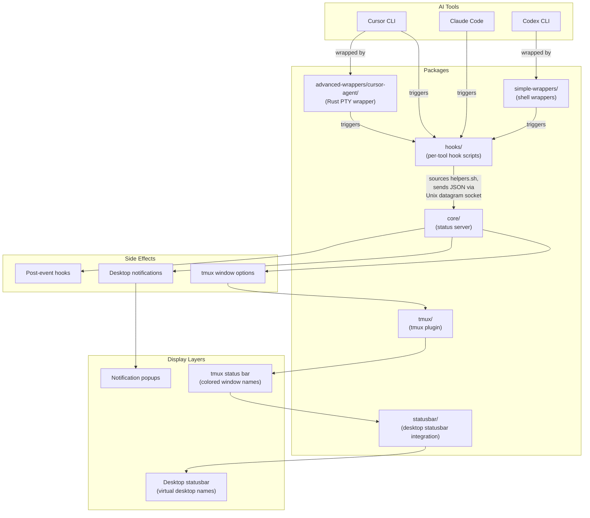
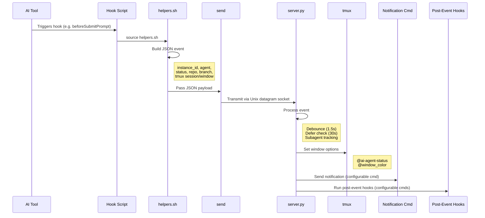
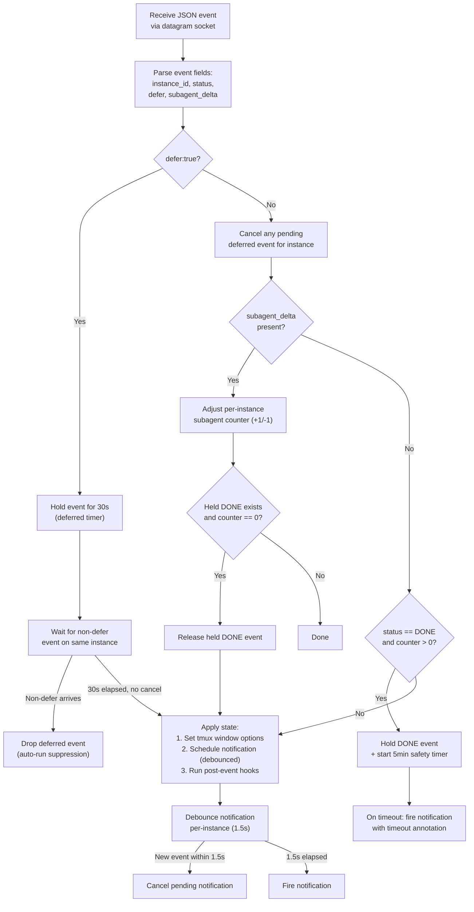
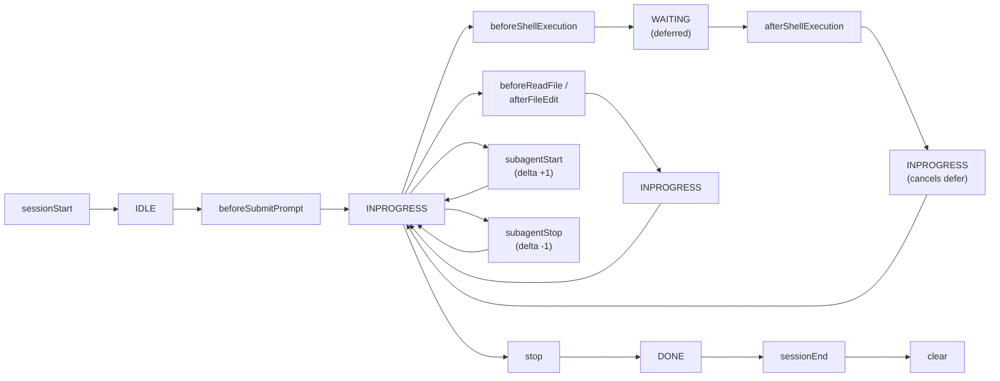
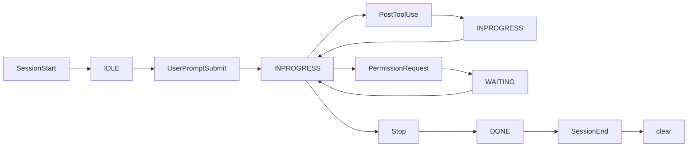
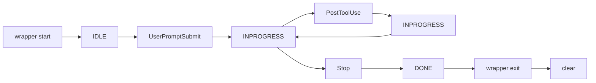
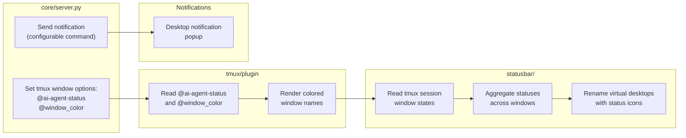
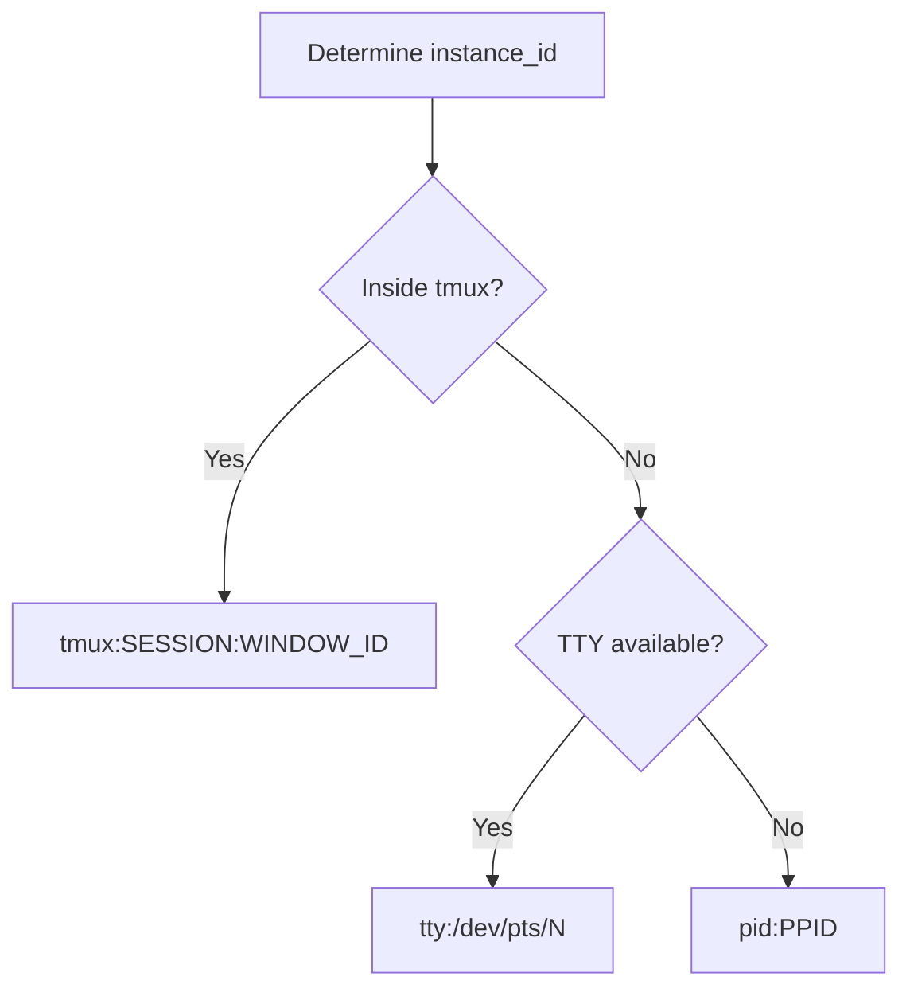

# agents-status System Design

## Architecture Overview

## Event Flow

## Server Internals

### Processing Pipeline

### Debouncing

Notifications are debounced per-instance with a 1.5-second window. Each new event for a given `instance_id` cancels any pending notification timer and starts a new one. This prevents notification spam during rapid state transitions (e.g. multiple file edits in quick succession).

### Deferred Events

Events marked `defer:true` are held for 30 seconds. If any non-deferred event arrives for the same instance during that window, the deferred event is silently dropped. This handles Cursor's `beforeShellExecution` hook, which fires for both real permission prompts (user must act) and auto-approved commands (no user action needed). By deferring, we only notify when the prompt genuinely requires attention.

### Subagent Tracking

The `subagent_delta` field (+1 or -1) adjusts a per-instance counter tracking active background subagents. When a DONE event arrives while the counter is above zero, the event is held rather than processed -- this prevents premature "Done" notifications while subagents are still running. The held DONE is released once the counter drops to zero. A 5-minute safety timeout ensures held events are eventually fired even if a subagent stop event is lost.

## Per-Tool Lifecycle

### Cursor CLI

### Claude Code

### Codex CLI (with simple wrapper)

## Display Chain

The display chain has two independent paths:

- **tmux path**: `server.py` sets per-window tmux user options. The tmux plugin reads these options during status bar rendering, applying color and label formatting to window names. The statusbar package then reads tmux session state, aggregates the statuses of all windows, and renames Hyprland virtual desktops accordingly.
- **notification path**: `server.py` fires a configurable notification command directly, producing desktop notification popups independent of the tmux display pipeline.

## Instance Identity

Each concurrent agent session is identified by a unique `instance_id`, constructed using a priority-based scheme:

| Priority | Format | When Used |
|----------|--------|-----------|
| 1 (highest) | `tmux:SESSION:WINDOW_ID` | Inside a tmux session |
| 2 | `tty:/dev/pts/N` | Terminal without tmux |
| 3 (fallback) | `pid:PPID` | No tmux, no TTY |

The tmux-based identity is preferred because it maps directly to the visual unit the user sees -- a tmux window. This ensures multiple concurrent agent sessions running in different tmux windows each track their status independently, with state correctly bound to the right window for both color rendering and notification context.
